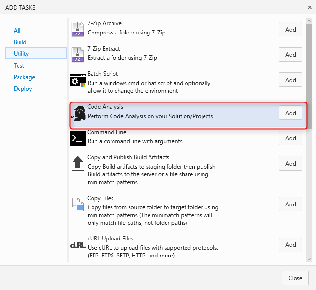
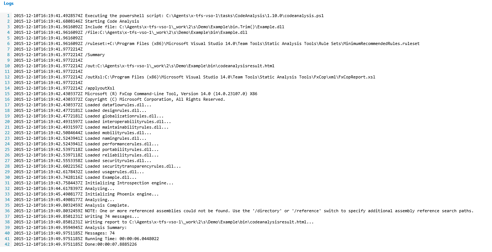

### How to use **Code Analysis** build / release tasks

Follow the below steps to upload this task to your account:

* Download the tasks repo as [zip file] or clone it using git:
* Extract the zip file of the desired task
* Open command prompt and navigate to the folder that contains a json and powershell files.

## Install / Upload Custom Task

*Follow instructions on how to upload the task using - https://github.com/TotalALM/VSO-Tasks

## How to use

* Add a new task and select Code Analysis.

| **Field** | **Information** | **Required** |
| --- | --- | --- |
| [Rule Set](https://msdn.microsoft.com/en-us/library/dd264925.aspx) | Built-in rule sets. | Yes |
| Build Directory | Directory which your (exe's/dll's) reside in.  Example: $(build.sourcesDirectory)\Demo\Example\bin | Yes |
| File's | Comma-Delimitied file names to run code analysis on. Example: Example.dll, Example.Data.dll  | Yes |
| Output File | Output file for the results to be written too.  By default the output is written using FxCopReport.xsl. Example: $(build.sourcesDirectory)\Demo\Example\bin\codeanalysisresult.html | Yes |
| Include Summary | Display's summary after analysis. The summary shows the number of items found, how many items were new, and the running time for the analysis.  | * |
| Verbose (Advanced) | Provides verbose output during analysis | * |
| Rule Set Directory (Advanced) | Provides a way to specify a alternative rule set directory. | No |
| XSL Template (Advanced) | By Default the output file is written using FxCopReport.xsl.  Use this field to specify a alternative xsl file. | No |
| FxCop Executable Path (Advanced) | By Default the this task will look for the static code analysis under C:\Program Files (x86)\Microsoft Visual Studio 12.0 and C:\Program Files (x86)\Microsoft Visual Studio 14.0.  Use this field to specify a alternative FxCop location. | No |

Output

Example Report (HTML)

